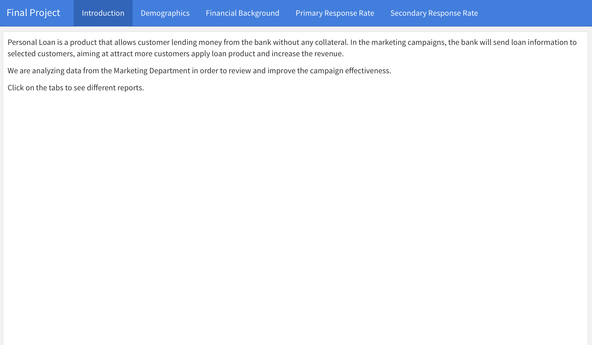

```{r setup, include=FALSE}
library(knitr)
opts_chunk$set(echo = TRUE, eval = TRUE, comment="", warning = FALSE, message = FALSE, tidy.opts=list(width.cutoff=55), tidy = TRUE)
```


## Introduction of Loan Marketing Campaign data sets

- Datasets are about a personal loan marketing campaign of HSBC.\
Personal Loan is a product that allows customer lending money from the bank without any collateral. In the marketing campaigns, the bank will send loan information to selected customers, aiming at attract more customers apply loan product and increase the revenue.\
We are working on projects in order to review and improve the campaign effectiveness. 
There are three datasets.\
\
- Campaign List: Contains all the information of this campaign\
\
- Lending Product Information: Historical loan usages and credit information of clients\
\
- Customer Information: (6 tables for 6 months) Detailed features of clients which are somewhat relevant to the campaign\
\


## Variables

- dummy_cus_key: Customers’ unique ID within the bank.
- channel: Different customer will receive the message through different channel.
             Phone Call: The contact channel with highest cost per                         contact.
             SMS: Text message. The cost is lower than phone call.
            Email: The contact channel with lowest cost per                         contact.

- contact_ind: ‘Y’ indicates:
               Phone Call:  customer picked up the call.
               SMS: customer read the message.
               Email: customer opened the email. 'N' otherwise.

- response: Indicates whether a customer apply for a new loan account.

- loan_amount: Indicates the applied loan amount.


## Variables


- msk_ever_loan_user: Indicates customers who ever had any loan product.

- msk_instl_loan_user: Indicates customers who ever had personal loan product.

- msk_other_lending_user: Indicates customers who ever had other unsecured lending product.

- msk_unauth_over_card_limit: Indicates customers who ever had unauthorized over-limit of credit card.

- msk_mth_since_last_limit_review: Number of months since last credit card limit increase.

- msk_bank_tenor: Number of months since customers open their first account with the bank.

## Variables

- msk_mortgage: Indicates customers who are holding mortgage by month-end of the data month (1 or Y means “Yes”).

- msk_total_saving_bal: Total deposit balance (including demand deposit and time deposit) by month-end of the data month.

- msk_total_investment_bal: Total investment product balance by month-end of the data month.

- msk_hold_insurance_ind: Indicates customers who are holding insurance product by month-end of the data month (1 or Y means “Yes”).

- msk_credit_card_bill_bal: Credit card bill amount of the bill cycle in the data month.


## Variables

- msk_credit_card_limit: Credit card limit by month-end of the data month.

- msk_credit_card_revolving_bal: The credit card revolving balance carried over from previous bill cycles.

- msk_total_credit_trn_amount: Total transaction amount of cash withdrawal or transfer-out in the data month.

- msk_total_credit_trn_atm_amount: Total transaction amount of cash withdrawal or transfer-out via ATM in the data month.

- msk_total_credit_trn_count: Total transaction count of cash withdrawal or transfer-out in the data month.


## Variables

- msk_total_deposit_trn_count: Total transaction count of cash deposit or transfer-in in the data month.

- msk_age: Age.

- msk_education: Education level.

- msk_gender: Gender.

- msk_job: Job category.

## Shiny Interface

```{r, out.width = "800px"}

```

## Shiny tabs

- Introduction: Overview of the project
- Demographics: Bar charts by demographic groups
- Financial Background: Client's background on finance status
- Primary Response Rate: Whether a customer picks up the call, reads the message, opens the email or not.
- Secondary Response Rate: Whether a customer applies for a new loan account or not.


## Data cleaning and feature selection 1

```{r input_data, echo = FALSE}
set.seed(2333)
library(data.table)
campaign.list <- fread(input = "../Data/DUMMY_CAMP_ELIG_BASE.csv", verbose = FALSE)
lending.product.info <- fread(input = "../Data/DUMMY_LOAN_USAGE_MASTER.csv",verbose = FALSE)
customer.info.m1 <- fread(input = "../Data/DUMMY_MONTH_DATA_M1.csv")
customer.info.m2 <- fread(input = "../Data/DUMMY_MONTH_DATA_M2.csv")
customer.info.m3 <- fread(input = "../Data/DUMMY_MONTH_DATA_M3.csv")
customer.info.m4 <- fread(input = "../Data/DUMMY_MONTH_DATA_M4.csv")
customer.info.m5 <- fread(input = "../Data/DUMMY_MONTH_DATA_M5.csv")
customer.info.m6 <- fread(input = "../Data/DUMMY_MONTH_DATA_M6.csv")

info <- rbind(customer.info.m1,customer.info.m2,customer.info.m3,customer.info.m4,customer.info.m5,customer.info.m6)
total.1 <- merge(x=campaign.list, y=lending.product.info, by="dummy_cus_key",all=TRUE)
total <- merge(x=total.1, y=info, by="dummy_cus_key",all=TRUE)


total.step1 <- total[complete.cases(total[,c("msk_age","msk_bank_tenor","msk_total_saving_bal")])]

total.step2 <- total.step1[is.na(total.step1$msk_total_credit_trn_amount)==1, 
                           msk_total_credit_trn_amount := median(total.step1$msk_total_credit_trn_amount,na.rm=T)]
total.step3 <- total.step2[is.na(total.step2$msk_total_credit_trn_atm_amount)==1, 
                           msk_total_credit_trn_atm_amount := 0]
total.step4 <- total.step3[is.na(total.step3$msk_total_deposit_trn_count)==1, 
                           msk_total_deposit_trn_count := 0]
total.step5 <- total.step4[is.na(total.step4$msk_total_credit_trn_count)==1, 
                           msk_total_credit_trn_count := 0]
total.step6 <- total.step5[is.na(total.step5$msk_credit_card_bill_bal)==1, 
                           msk_credit_card_bill_bal := median(total.step5$msk_credit_card_bill_bal,na.rm=T)]
total.step7 <- total.step6[is.na(total.step6$msk_credit_card_limit)==1, 
                           msk_credit_card_limit :=  median(total.step6$msk_credit_card_limit,na.rm=T)]
total.step8 <- total.step7[is.na(total.step7$msk_mth_since_last_limit_review)==1, 
                           msk_mth_since_last_limit_review :=  median(total.step7$msk_mth_since_last_limit_review, na.rm=T)]
total.step9 <- total.step8[is.na(total.step8$loan_amount)==1, 
                           loan_amount :=  0]

total.final <- total.step9[,c("msk_total_investment_bal", "msk_credit_card_revolving_bal"):=NULL]

delete.max <- c("msk_mth_since_last_limit_review","msk_age","msk_bank_tenor","msk_total_saving_bal","msk_total_credit_trn_amount","msk_total_credit_trn_atm_amount","msk_total_deposit_trn_count","msk_total_credit_trn_count","msk_credit_card_bill_bal","msk_credit_card_limit")

is.above <- function(x){
  return(x >= (mean(x, na.rm=T) + 3*sd(x, na.rm=T)))
}
rows.to.include <- rowMeans(x = total.final[, lapply(X = .SD, FUN = "is.above"), .SDcols = delete.max]) == 0
filtered.total.final <- total.final[rows.to.include,]

recall <- function(df){
  tp <- df[2,2]
  fn <- df[1,2]
  recall <- tp/(tp+fn)
  return(recall)
}

accuracy <- function(df){
  tp <- df[2,2]
  fn <- df[1,2]
  tn <- df[1,1]
  fp <- df[1,2]
  accuracy <- (tp+tn)/(tp+fn+tn+fp)
  return(accuracy)
}


```


```{r eval=TRUE, message=FALSE, error=FALSE, warning=FALSE}
library(Amelia)
missmap(data.frame(campaign.list), legend = T, col = c("grey", "dodgerblue"),
        rank.order=F,y.labels = NULL,y.at = NULL, main = "Missingness Map of campaign.list")
```

## Data cleaning and feature selection 2
```{r eval=TRUE, message=FALSE, error=FALSE, warning=FALSE}
missmap(data.frame(lending.product.info), legend = T, col = c("grey", "dodgerblue"),
        rank.order=F,y.labels = NULL,y.at = NULL, main = "Missingness Map of lending.product.info")
```

## Data cleaning and feature selection 3
```{r eval=TRUE, message=FALSE, error=FALSE, warning=FALSE}
missmap(data.frame(info), legend = T, col = c("grey", "dodgerblue"),
       rank.order=F,y.labels = NULL,y.at = NULL, main = "Missingness Map of customer information in 6 months")
```


## Data cleaning and feature selection 4

- the Customer Information datasets are unioned and merged with other datasets.\

- We handle the missing data use different technics based on the meaning of each column and the numbers of missing data in each column.\

- There are two features that are deleted since they have too many NAs\
msk_total_investment_bal(Total investment product balance by month-end of the data month)\
msk_credit_card_revolving_bal (The credit card revolving balance carried over from previous bill cycle)

## Data cleaning and feature selection 5

- An example of handling the missing data in one column\

- msk_total_credit_trn_atm_amount(Total transaction amount of cash withdrawal or transfer-out via ATM in the data month)\

```{r eval=TRUE, message=FALSE, error=FALSE,warning=FALSE}
summary(info$msk_total_credit_trn_atm_amount)
```

There are 279453 NAs. Since it's nearly 30% percentage, if we fill them with mean, the original distribution of this column will be hugely changed. However, since the min value of this column is not 0 but 10, we assume that the NAs represent for no transaction. So, we fill the NAs with 0.


## Data cleaning and feature selection 6

- We find that there are many extreme large values, we need to delete those extreme values in some columns.
If data is large than mean + 3*standard deviation then it is defined as outlier.\

```{r eval=TRUE, message=FALSE, error=FALSE,warning=FALSE}
delete.max <- c("msk_mth_since_last_limit_review","msk_age","msk_bank_tenor","msk_total_saving_bal","msk_total_credit_trn_amount","msk_total_credit_trn_atm_amount","msk_total_deposit_trn_count","msk_total_credit_trn_count","msk_credit_card_bill_bal","msk_credit_card_limit")

is.above <- function(x){
  return(x >= (mean(x, na.rm=T) + 3*sd(x, na.rm=T)))
}
rows.to.include <- rowMeans(x = total.final[, lapply(X = .SD, FUN = "is.above"), .SDcols = delete.max]) == 0
```

- There are still 650564 rows of cleaned and filtered data, which is more than 90% of original dataset. It looks good.


## Goals for data analysis

- Topic 1: Effectiveness of loan campaign: increase the response rate\
Methods: logistic regression, random forest, adaboost

- Topic 2: Channel selection: Choose the best channel to contact selected clients.\
Assumption: In the historical data. If the clients response, then the channel is regard as best channel for him.\
Methods: random forest, adaboost

- Topic 3: Loan amount: Choose top clients with the highest loan amounts\
Methods: linear regression, random forest


## Data processing for models

- There exists severe imbalance of "response" and "channel". The sampling and resampling technics were used to handle this problem.\

- Relevant datasets for topics are divided into training and testing set with a ratio of 7:3.\

- Ten fold cross validation is used when we need to tune some hyperparameters for models.


## Topic1: Effectiveness of loan campaign
```{r rf model, echo=FALSE}
set.seed(2333)
# data processing
filtered.total.final.unique <- unique(filtered.total.final, incomparables=FALSE, fromLast=FALSE,
                                      by=names(filtered.total.final))

numeric.column <- c("msk_mth_since_last_limit_review",  "msk_age", "msk_bank_tenor", "msk_total_saving_bal", "msk_total_credit_trn_amount", "msk_total_credit_trn_atm_amount", "msk_total_deposit_trn_count", "msk_total_credit_trn_count", "msk_credit_card_bill_bal","msk_credit_card_limit")

filtered.total.final.unique <- copy(filtered.total.final.unique)[ , (numeric.column) := 
                                                                    as.data.table(scale(.SD)),
                                                                  .SDcols = numeric.column]

filtered.total.final1 <- filtered.total.final.unique[get("response")==1,]
filtered.total.final2 <- filtered.total.final.unique[get("response")==0,]

# The imbalance of data.
row1 <- dim(filtered.total.final1)[1]     # 22214 rows
row2 <- dim(filtered.total.final2)[1]     # 627987 rows

sampled.rows <- sample(x=c(1:row2),size=row1)
filtered.total.final3 <- filtered.total.final2[sampled.rows,]


# Creat trainning dataset (70%)
sampled.train1 <- sample(x=c(1:row1),size=0.7*row1)
sampled.train2 <- sample(x=c(1:row1),size=0.7*row1)
balance.train1 <- filtered.total.final1[sampled.train1,]
balance.train2 <- filtered.total.final3[sampled.train2,]
balance.train <- rbind(balance.train1,balance.train2)

# Creat teting dataset (30%)
balance.test1 <- filtered.total.final1[-sampled.train1,]
balance.test2 <- filtered.total.final3[-sampled.train2,]
balance.test <- rbind(balance.test1,balance.test2)


# Train rf
library(randomForest)
library(e1071)
# We don't need key, contact_ind, loan amount, channel(we don't know the channel beforehead)
rf.dat <- data.frame(balance.train[,c(-1,-3,-4,-5)])

colApply <- function(dat, cols = colnames(dat), func = as.factor) { 
     dat[cols] <- lapply(dat[cols], func) 
     return(dat)
} 

rf.dat.factor <- colApply(rf.dat, c("response","msk_instl_loan_user","msk_other_lending_user","msk_gender","msk_education","msk_job","msk_mortgage"))

# rf.tune <- tune(randomForest, rf.dat.factor[,-1], rf.dat.factor[,1],
#                 ranges=list(ntree=seq(100,200,30), mtry=seq(1,20,2)))
# We get the best parameters. ntree:190  mtry:13


rf.result <- randomForest(response~., data = rf.dat.factor, ntree=190, mtry= 13, importance=TRUE)
rf.importance <- importance(rf.result, type=1, scale=TRUE)


# performance in trainning data
confusion <- rf.result$confusion
rf.train.recall <- recall(confusion)    
rf.train.accuracy <- accuracy(confusion)  

# Check the method in the test data
rf.dat.test <- data.frame(balance.test[,c(-1,-3,-4,-5)])

rf.dat.factor.test <- colApply(rf.dat.test, c("response","msk_instl_loan_user","msk_other_lending_user","msk_gender","msk_education","msk_job","msk_mortgage"))

pred <- predict(rf.result, rf.dat.factor.test)


Freq <- table(pred, rf.dat.factor.test$response)
rf.test.recall <- recall(Freq)   
rf.test.accuracy <- accuracy(Freq)  


response.rate.randomselect <- filtered.total.final.unique[,lapply(X=.SD,FUN = "mean"),.SDcols="response"]
# It shows that the response rate of ramdon select.
rf.dat.total <- data.frame(filtered.total.final.unique[,c(-1,-3,-4,-5)])

rf.dat.factor.total <- colApply(rf.dat.total, c("response","msk_instl_loan_user","msk_other_lending_user","msk_gender","msk_education","msk_job","msk_mortgage"))

pred2 <- predict(rf.result, rf.dat.factor.total)
Freq2 <- table(pred2,rf.dat.factor.total$response)
lift <- recall(Freq2)/response.rate.randomselect
library(ROCR)
pred.rf.prob <- predict(rf.result,rf.dat.factor.test,type = "prob")
pred.rf.trans <- prediction(pred.rf.prob[,2], rf.dat.factor.test$response)
response.rf.auc <- performance(pred.rf.trans,'auc')@y.values[[1]]

```


```{r logistic model, echo=FALSE}
set.seed(2333)
library(tidyverse)
library(MASS)
library(ROCR)

fit.response <- glm(response~., data = rf.dat.factor, family=binomial(link='logit'))
step.model <- fit.response %>% stepAIC(trace = FALSE)
pred.log.response <- predict(step.model ,rf.dat.factor.test, type='response')
pred.log.response  <- ifelse(pred.log.response > 0.5,1,0)

Freq <- table(pred.log.response, rf.dat.factor.test$response)
recall.logi <- recall(Freq)    
accuracy.logi <- accuracy(Freq)  
pred.log.prob <- predict(step.model ,rf.dat.factor.test, type='response')
pred.log.trans <- prediction(pred.log.prob, rf.dat.factor.test$response)

auc.logi <- performance(pred.log.trans,'auc')@y.values[[1]]
odds.logi <- exp(coef(step.model))  # odds ratio
```


```{r adaboost-, echo=FALSE}
set.seed(2333)
library(fastAdaboost)
train.adaboost.response <- adaboost(response~., rf.dat.factor, 200)
pred.adaboost.response <- predict(train.adaboost.response, newdata=rf.dat.factor.test)

response.ada.confusion <- table(pred.adaboost.response$class, rf.dat.factor.test$response)
response.recall.ada <- recall(response.ada.confusion)
response.accuracy.ada <- accuracy(response.ada.confusion)


response.pred.total <- predict(rf.result, rf.dat.factor.total)
response.Freq.total <- table(response.pred.total,rf.dat.factor.total$response)
response.recall.total <- recall(response.Freq.total)

response.lift.ada <- response.recall.total/response.rate.randomselect

pred.ada.trans <- prediction(pred.adaboost.response$prob[,2], rf.dat.factor.test$response)

response.auc.ada <- performance(pred.log.trans,'auc')@y.values[[1]]

```


- The response rate is not high, we should find a way to improve that
- In the marketing situation, the thing we care more is the recall, since we try to select as many as the target clients. recall: TP / (TP+FN)

```{r echo=FALSE}
# response rate
response_rate <- filtered.total.final[,lapply(X=.SD,FUN = "mean"),.SDcols = "response"]
response_rate_channel <- filtered.total.final[,lapply(X=.SD,FUN = "mean"),.SDcols = "response", by = "channel"]
response <- rbind(response_rate,response_rate_channel[,2])
```


```{r eval=TRUE, message=FALSE, error=FALSE,warning=FALSE}
barplot(height = 100*as.matrix(t(response)), names.arg = c("All","Phone_call","SMS","Email"),
        main = "Percentage of response from different channel", 
        ylab = "Response rate (percentage)",
        xlab = "Channel",
        col="dodgerblue")
```


## imbalance of observation
```{r eval=TRUE, message=FALSE, error=FALSE,warning=FALSE}
response <- dim(filtered.total.final1)[1]  
not.response <- dim(filtered.total.final2)[1]    
dt <- data.table(type=c("response","not.response"),c(response,not.response))
colnames(dt) <- c("type","num")
dt

```


In the training dataset, we want to make number of responded clients and number of not response to be balanced, so we will randomly select 22214 rows in the dataset of not responded clients to make the data balanced. Since the number of rows of very large, there is no need to use the resampling strategy, which will destroy the original distribution.


## Method 1: logistic regression with stepwise selection 1

- This model is for the explanation to our business patterners.
- Recall and accuracy are as follows.

```{r eval=TRUE, message=FALSE, error=FALSE,warning=FALSE}
recall.logi
accuracy.logi
```


## Method 1: logistic regression with stepwise selection 2

- Odds ratios for all the features are as follows. We will draw some inference in our final report.

```{r eval=TRUE, message=FALSE, error=FALSE,warning=FALSE}
odds.logi
```

## Method 1: logistic regression with stepwise selection 3

- AUC value and ROC curve

```{r eval=TRUE, message=FALSE, error=FALSE, warning=FALSE}
auc.logi
plot(performance(pred.log.trans, "tpr", "fpr"), colorize = T, lwd = 3, main = "ROC Curves")
```


## Method 2: Random forset 1

- This model is for capture the nonlinear trend and improve the quality of production
- Recall and accuracy for test data

```{r eval=TRUE, message=FALSE, error=FALSE, warning=FALSE}
rf.test.recall
rf.test.accuracy
```

## Method 2: Random forset 2
- error plot when fitting the model
```{r eval=TRUE, message=FALSE, error=FALSE, warning=FALSE}
plot(rf.result)
```

## Method 2: Random forset 3

- AUC value and ROC curve

```{r eval=TRUE, message=FALSE, error=FALSE, warning=FALSE}
response.rf.auc
plot(performance(pred.rf.trans, "tpr", "fpr"), colorize = T, lwd = 3, main = "ROC Curves")
```


## Method 2: Random forset 4

- The importance of all the features is as follows (Some inference will draw in the report)

```{r eval=TRUE, message=FALSE, error=FALSE, warning=FALSE}
rf.importance
plot(rf.importance)  
```


## Method 2: Random forset 5

- Finally, we show the influence of model to the whole dataset to our out business partner\
- Use the "lift": When our target is the response rate, what we care more is how much the affiance is increased comparing to random select.\
- Def of lift: recall of the model/accuracy of random select

```{r eval=TRUE, message=FALSE, error=FALSE, warning=FALSE}
lift <- recall(Freq2)/response.rate.randomselect
lift
```


## Method 3: adaboost 1

- It has a great advantage of avoid overfitting and may have a better output

- It's also friendly for business partners for they can directly run the code with new data without tuning parameters.


## Method 3: adaboost 2

- response, accuracy

```{r eval=TRUE, message=FALSE, error=FALSE, warning=FALSE}
response.recall.ada
response.accuracy.ada
```


## Method 3: adaboost 3

- AUC and ROC curve

```{r eval=TRUE, message=FALSE, error=FALSE, warning=FALSE}
response.auc.ada
plot(performance(pred.ada.trans, "tpr", "fpr"), colorize = T, lwd = 3, main = "ROC Curves")
```

## Method 3: adaboost 4

- Life when apply the modle in the whole dataset (Same situation with previous random forest model)

```{r eval=TRUE, message=FALSE, error=FALSE, warning=FALSE}
response.lift.ada
```

## Topic 2: Channel selection

```{r random forest, echo=FALSE}
set.seed(2333)
# We don't need key, response, contact_ind, loan amount
# Also, for the same user with the same channnel, we just radomly select one record
channel.dat <- filtered.total.final.unique[get("response")==1 & get("contact_ind")=="Y", c(-2,-3,-4)]

number <- max(data.frame(channel.dat[, .N, by="channel"])[,2])

phone <- channel.dat[get("channel")=="Phone Call",]
email <- channel.dat[get("channel")=="Email",]
sms <- channel.dat[get("channel")=="SMS",]

# 0.7 train, 0.3 test
# phone
phone.number.train <- sample(x=(1:number), size = number*0.7)
phone.dat.train <- phone[phone.number.train,]
phone.dat.test <- phone[-phone.number.train,]

# email
email.number.resample <- sample(x=(1:data.frame(channel.dat[, .N, by="channel"])[2,2]),size = number,
                                replace = T)
email.dat.resample <- email[email.number.resample,]
email.number.train <- sample(x=(1:number),size = number*0.7)
email.dat.train <- email.dat.resample[email.number.train,]
email.dat.test <- email.dat.resample[-email.number.train,]


# sms
sms.number.resample <- sample(x=(1:data.frame(channel.dat[, .N, by="channel"])[3,2]),size = number,
                                replace = T)
sms.dat.resample <- sms[sms.number.resample,]
sms.number.train <- sample(x=(1:number),size = number*0.7)
sms.dat.train <- sms.dat.resample[sms.number.train,]
sms.dat.test <- sms.dat.resample[-sms.number.train,]

# combine to get trainning and test set
channel.balance.train <- rbind(phone.dat.train,email.dat.train,sms.dat.train)
channel.balance.test <- rbind(phone.dat.test,email.dat.test,sms.dat.test)

channel.balance.train.factor <- colApply(data.frame(channel.balance.train[,-1]), c("channel","msk_instl_loan_user","msk_other_lending_user","msk_gender","msk_education","msk_job","msk_mortgage"))


# rf.channel.tune <- tune(randomForest, channel.balance.train.factor[,-1], channel.balance.train.factor [,1],
#                 ranges=list(ntree=seq(100,200,20), mtry=seq(1,20,4)))
# We get ntree = 200, mtry=5

# Train the model
library(randomForest)
rf.channel.result <- randomForest(channel~., data = channel.balance.train.factor, ntree=200, mtry= 5, importance=TRUE)
rf.channel.importance <- importance(rf.channel.result, type=1, scale=TRUE)

confusion <- rf.channel.result$confusion
overall.accuracy <- 1 - (1/3)*confusion[1,4] - (1/3)*confusion[2,4] - (1/3)*confusion[3,4]

# Show the performance in the test dataset
channel.balance.test.factor <- colApply(data.frame(channel.balance.test[,-1]), c("channel","msk_instl_loan_user","msk_other_lending_user","msk_gender","msk_education","msk_job","msk_mortgage"))

pred <- predict(rf.channel.result, channel.balance.test.factor)
Freq <- table(pred, channel.balance.test.factor$channel)

recall.email <- Freq[1,1]/(Freq[1,1]+Freq[1,2]+Freq[1,3])
recall.phone <- Freq[2,2]/(Freq[2,1]+Freq[2,2]+Freq[2,3])
recall.sms <- Freq[3,3]/(Freq[3,1]+Freq[3,2]+Freq[3,3])

rf.accuracy <- (Freq[1,1]+Freq[2,2]+Freq[3,3])/dim(channel.balance.test)[1]
```


```{r adaboost+, echo=FALSE}
library(fastAdaboost)
# phone.data
phone.train.factor <- ifelse(channel.balance.train.factor$channel=="Phone Call",1,0)
phone.channel.balance.train.factor <- cbind(phone.train.factor,channel.balance.train.factor[,-1])
phone.test.factor <- ifelse(channel.balance.test.factor$channel=="Phone Call",1,0)
phone.channel.balance.test.factor <- cbind(phone.test.factor,channel.balance.test.factor[,-1])

# email.data
email.train.factor <- ifelse(channel.balance.train.factor$channel=="Email",1,0)
email.channel.balance.train.factor <- cbind(email.train.factor,channel.balance.train.factor[,-1])
email.test.factor <- ifelse(channel.balance.test.factor$channel=="Email",1,0)
email.channel.balance.test.factor <- cbind(email.test.factor,channel.balance.test.factor[,-1])

# sms data
sms.train.factor <- ifelse(channel.balance.train.factor$channel=="SMS",1,0)
sms.channel.balance.train.factor <- cbind(sms.train.factor,channel.balance.train.factor[,-1])
sms.test.factor <- ifelse(channel.balance.test.factor$channel=="SMS",1,0)
sms.channel.balance.test.factor <- cbind(sms.test.factor,channel.balance.test.factor[,-1])


# phone.adaboost
train.adaboost.phone <- adaboost(phone.train.factor~., phone.channel.balance.train.factor, 100)
pred.adaboost.phone <- predict(train.adaboost.phone, newdata=phone.channel.balance.test.factor)
phone.confusion <- table(pred.adaboost.phone$class, phone.channel.balance.test.factor$phone.test.factor)

# email.adaboost
train.adaboost.email <- adaboost(email.train.factor~., email.channel.balance.train.factor, 100)
pred.adaboost.email <- predict(train.adaboost.email, newdata=email.channel.balance.test.factor)
email.confusion <- table(pred.adaboost.email$class, email.channel.balance.test.factor$email.test.factor)

# sms.adaboost
train.adaboost.sms <- adaboost(sms.train.factor~., sms.channel.balance.train.factor, 100)
pred.adaboost.sms <- predict(train.adaboost.sms, newdata=sms.channel.balance.test.factor)
sms.confusion <- table(pred.adaboost.sms$class, sms.channel.balance.test.factor$sms.test.factor)

phone.recall <- recall(phone.confusion)
phone.accuracy <- accuracy(phone.confusion)

email.recall <- recall(email.confusion)
email.accuracy <- accuracy(email.confusion)

sms.recall <- recall(sms.confusion)
sms.accuracy <- accuracy(sms.confusion)

result <- data.frame(c(phone.recall,phone.accuracy),
                     c(email.recall,email.accuracy),
                     c(sms.recall,sms.accuracy))
colnames(result) <- c("phone","email","sms")
rownames(result) <- c("recall","accuracy")
```


- After getting the target user, the following question is how to connect them.\
- We select those responded clients (with response=1, contact_ind=Y) and determine which channel are the best to contact those clients.\
- In this part, the only thing we care about is the accuracy, so we don't use any regression model.
- Assumption: In the historical data. If the clients response, then the channel is regard as best channel for him.\
Methods: random forest, adaboost


## imbalance of data

- The data is imbalanced. Since the total number of rows is small, we use resampling to make them balance.

```{r eval=TRUE, message=FALSE, error=FALSE, warning=FALSE}
channel.dat[, .N, by="channel"]
```


## Method 1: Random forest 1

- error plot when fitting the model
```{r eval=TRUE, message=FALSE, error=FALSE, warning=FALSE}
plot(rf.channel.result)
```


## Method 1: Random forest 2

- importance of varibale

```{r eval=TRUE, message=FALSE, error=FALSE, warning=FALSE}
rf.channel.importance
plot(rf.channel.importance)    
```

## Method 1: Random forest 3

- recall for each channel: email, phone, sms

```{r eval=TRUE, message=FALSE, error=FALSE, warning=FALSE}
dt.recall <- data.frame(c(recall.email,recall.phone,recall.sms))
rownames(dt.recall) <- c("recall.email","recall.phone","recall.sms")
colnames(dt.recall) <- c("recall")
dt.recall
rf.accuracy 
```

- overall accuracy 

```{r eval=TRUE, message=FALSE, error=FALSE, warning=FALSE}
rf.accuracy 
```


## Method 2: Adaboost

- Original datasets are transform to three datasets with 0-1 represent the channel.
- Then three adaboost models are applied for three channels.
- Recall and accuracy for each channel.

```{r eval=TRUE, message=FALSE, error=FALSE, warning=FALSE}
result
```


## Topic 3: Loan amount: Choose top clients with the highest loan amounts

- Regardless of the risk management process, banks always prefer larger amount of single loan.\
- Sometimes the loan campaign has a budget, we just can lend money to some of the target clients who are willing to borrow money.\
- Besides, we won't know how much our clients want to borrow unless we make future discussion with them.\
- So, we need to predict loan amount for each before head.


```{r randonforest:regression tree, echo=FALSE}
set.seed(2333)
# We don't need key, response, contact_ind, channel
# Also, for the same user with the same channnel, we just radomly select one record
loan_amount.dat <- filtered.total.final.unique[get("loan_amount")!=0 & get("contact_ind")=="Y", c(-2,-3,-5)]
unique.loan_amount.dat <- loan_amount.dat[,c(-1)]


# 0.7 train, 0.3 test
train.number <- sample(x=c(1:dim(unique.loan_amount.dat)[1]),size=0.7*dim(unique.loan_amount.dat)[1])
loan_amount.train <- unique.loan_amount.dat[train.number,]
loan_amount.test <- unique.loan_amount.dat[-train.number,]

loan_amount.train.factor <- colApply(data.frame(loan_amount.train), c("msk_instl_loan_user","msk_other_lending_user","msk_gender","msk_education","msk_job","msk_mortgage"))


# rf.loan_amount.tune <- tune(randomForest, loan_amount.train.factor[,-1], loan_amount.train.factor [,1],
#                 ranges=list(ntree=seq(100,200,20), mtry=seq(1,20,4)))
# We get ntree = 160, mtry=13


# Train the model
library(randomForest)
rf.loan_amount.result <- randomForest(loan_amount~., data = loan_amount.train.factor, ntree=160, mtry= 13,
                                  importance=TRUE)
rf.loan_amount.importance <- importance(rf.loan_amount.result, type=1, scale=TRUE)

avg.rsq.train <- mean(rf.loan_amount.result$rsq)

# Show the performance in the test dataset
loan_amount.test.factor <- colApply(data.frame(loan_amount.test), c("msk_instl_loan_user","msk_other_lending_user","msk_gender","msk_education","msk_job","msk_mortgage"))

pred <- predict(rf.loan_amount.result, loan_amount.test.factor)
mse <- sum((pred-loan_amount.test.factor$loan_amount)^2)/(length(pred)-1)
rsq <- 1-(mse/var(pred))

```


```{r regression, echo=FALSE}
library(tidyverse)
fit.amount <- lm(loan_amount~., data = loan_amount.train.factor)
step.model.amount <- fit.amount %>% stepAIC(trace = FALSE)

```

```{r compare to ramdon, echo=FALSE}
unique.loan_amount.dat.factor <- colApply(data.frame(unique.loan_amount.dat), c("msk_instl_loan_user","msk_other_lending_user","msk_gender","msk_education","msk_job","msk_mortgage"))

pred.total <- predict(rf.loan_amount.result, unique.loan_amount.dat.factor)
pred.total.num <- sort(pred.total,index.return=T,decreasing = T)$ix[1:1000]
amount.selected <- sum(unique.loan_amount.dat[pred.total.num,"loan_amount"])
random.num <- sample(x=c(1:dim(unique.loan_amount.dat)[1]),size = 1000)
amount.random <- sum(unique.loan_amount.dat[random.num,"loan_amount"])
increase.percentage <- 100*(amount.selected-amount.random)/amount.random
# increase.percentage
# The increase of amount of loan is 36.87%
```


## Method 1: Stepwise regression (For explaination) 

- R-squared and parameters
- R-squared is the percentage of the dependent variable variation that a linear model explains.
- Some inference based on parameters will showed in report.

```{r include=TRUE, eval=TRUE, message=FALSE, error=FALSE, warning=FALSE}
summary(step.model.amount)$r.square
step.model.amount$coefficients
```


## Method 2: Random forest for more accurate prediction 1

- The R-squared of stepwise regression model is relatively low.
- So, we need to use advance method which can identify some non-linear relationship and get more accurate prediction.
- For comparation, R-squared is also calculated for this model

```{r eval=TRUE, message=FALSE, error=FALSE, warning=FALSE}
mse <- sum((pred-loan_amount.test.factor$loan_amount)^2)/(length(pred)-1)
rsq <- 1-(mse/var(pred))
rsq
```


## Method 2: Random forest for more accurate prediction 2

- error plot when fitting the model

```{r eval=TRUE, message=FALSE, error=FALSE, warning=FALSE}
plot(rf.loan_amount.result)
```


## Method 2: Random forest for more accurate prediction 3
- The importance of all features

```{r eval=TRUE, message=FALSE, error=FALSE, warning=FALSE}
rf.loan_amount.importance
plot(rf.loan_amount.importance)
```


## Method 2: Random forest for more accurate prediction 4

- Now, since the amount of deposit is limited, we only allowed to give 1000 clients the loan in this campaign. We need to find a way to target the clients who will borrow the largest amount of money.
- We will use the model in the whole unique dataset of loan_amount which contain all unique information of clients who get the loan and see the increase comparing to the random select. 
- The increment is as follows. Besides, the less the number of chosen clients, the higher the increment will be.

```{r eval=TRUE, message=FALSE, error=FALSE, warning=FALSE}
increase.percentage
```


## Other ways to handle the limited budget?

- The limited budget shows the bank may in shortage of amount of liquidity and want to avoid potential liquidity risk.
- We don't we lunch a deposit campaign to get more money.

## The next step for the data analysis
- We already get some historical data of the marketing campaign of deposit, because the bank have already aware of the liquidity risk and want to get more money.
- Unfortunately, Since the campaign just started, we just get the preliminary data with only one target variable: response\
But we can still analysis that dataset to increase the efficiency of the deposit campaign.


```{r,include=FALSE}
library(shiny)
library(rmarkdown)
library(knitr)
library(Hmisc)
library(DT)
library(dplyr)
library(data.table)
```

```{r,include=FALSE}
dat <- fread(input = "../Data/bank-additional-full.csv")
```


```{r,include=FALSE}
age.name<-"age"
job.name<-"job"
marital.name<-"marital"
education.name<-"education"
default.name<-"default"
housing.name<-"housing"
loan.name<-"loan"
contact.name<-"contact"
month.name<-"month"
day_of_week.name<-"day_of_week"
duration.name<-"duration"
campaign.name<-"campaign"
pdays.name<-"pdays"
previous.name<-"previous"
poutcome.name<-"poutcome"
emp.var.rate.name<-"emp.var.rate"
cons.price.idx.name<-"cons.price.idx"
cons.conf.idx.name<-"cons.conf.idx"
euribor3m.name<-"euribor3m"
nr.employed.name<-"nr.employed"
y.name<-"y"
na.value<-"unknown"
all.var.name<-c(age.name,job.name,marital.name,education.name,default.name,housing.name,loan.name,contact.name,month.name,day_of_week.name,duration.name,campaign.name,pdays.name,previous.name,poutcome.name,emp.var.rate.name,cons.price.idx.name,cons.conf.idx.name,euribor3m.name,nr.employed.name,y.name)

age.group.name <- "Age Group"
cuts.age <- c(20, 30, 40, 50, 60,100)
dat[, eval(age.group.name) := cut2(x = get(age.name), cuts = cuts.age)]
respondent.variables <- c(age.group.name,job.name,marital.name,education.name,housing.name,loan.name,contact.name)
index.variable<-c(emp.var.rate.name,cons.price.idx.name,cons.conf.idx.name,euribor3m.name,nr.employed.name)

all_variable<-c(age.name,age.group.name,job.name,marital.name,education.name,housing.name,default.name,loan.name,contact.name,month.name,day_of_week.name,duration.name,campaign.name,pdays.name,previous.name,poutcome.name,emp.var.rate.name,cons.price.idx.name,cons.conf.idx.name,euribor3m.name,nr.employed.name)

cate.variable<-c(job.name,marital.name,education.name,housing.name,loan.name,contact.name,month.name,day_of_week.name,previous.name,poutcome.name)
```


```{r include=FALSE}
round.numerics <- function(x, digits){
  if(is.numeric(x)){
    x <- round(x = x, digits = digits)
  }
  return(x)
}
#1
percentage.table <- function(x, digits = 1){
  tab <- table(x)
  percentage.tab <- 100*tab/(sum(tab))
  rounded.tab <- round(x = percentage.tab, digits = digits)
  return(rounded.tab)
}
divide_fun<-function(arg,data=dat){
  tab<-percentage.table(x = dat[get(y.name) == get(y.name)[1],get(arg)])
  return(tab)
}

#2
mean_value_fun<-function(arg,index,data=dat){
  dat_select<-data[,mean(get(index),na.rm = TRUE),by=arg]
  names(dat_select)<-c(arg,index)
  dat_select<-dat_select[, lapply(X = .SD, FUN = "round.numerics", digits = 3)]
  return(dat_select)
}

#3

#4
fit.model <- function(dat, outcome.name,input.name,digits = 3) {
  the.formula <- create.formula(outcome.name = outcome.name,input.names = input.name)
  
  mod <- glm(formula = the.formula, family = "binomial",data = dat)
  mod.summary <- logistic.regression.summary(glm.mod = mod,digits = digits)
  
  mod.summary.rounded <- mod.summary[, lapply(X = .SD,FUN = "round.numerics", digits = digits)]
  return(list(summary = mod.summary.rounded, obj = mod))
}


logistic.regression.summary <- function(glm.mod, digits = 3, alpha = 0.05) {
  glm.coefs <- as.data.table(summary(glm.mod)$coefficients,keep.rownames = TRUE)
  setnames(x = glm.coefs, old = "rn", new = "Variable")
  z <- qnorm(p = 1 - alpha/2, mean = 0, sd = 1)
  glm.coefs[, Odds.Ratio := exp(Estimate)]
  glm.coefs[, OR.Lower.95 := exp(Estimate - z * `Std. Error`)]
  glm.coefs[, OR.Upper.95 := exp(Estimate + z * `Std. Error`)]
  return(glm.coefs[])
}

create.formula <- function(outcome.name, input.names, return.as = "character") {

  
  all.input.names <- unique(c(input.names))
  all.input.names <- all.input.names[all.input.names !=outcome.name]
  # if (!is.na(all.data.names[1])) {
  #   all.input.names <- all.input.names[all.input.names %in%all.data.names]
  # }
  input.names.delineated <- sprintf("`%s`", all.input.names)
  the.formula <- sprintf("`%s` ~ %s", outcome.name, paste(input.names.delineated,collapse = " + "))
  if (return.as == "formula") {
    return(as.formula(the.formula))
  }
  if (return.as != "formula") {
    return(the.formula)
  }
}

  

model_fun<-function(outcome.arg,model.var,data=dat){
  
  
  res <- fit.model(dat = dat, outcome.name = outcome.arg, input.name = model.var)
  return(res$summary)
}
```


## Information about Market Campaigns Data

- The data is related with direct marketing campaigns of a Portuguese banking institution. \
- The marketing campaigns were based on phone calls. Often, more than one contact to the same client was required, in order to access if the product (bank term deposit) would be ('yes') or not ('no') subscribed

## Descriprion of Input Variables

- age: age of customers (numeric)
- job: type of job (categorical)
- marital: marital status (categorical)
- education: degree of education  (categorical)
- default: has credit in default? (categorical)
- housing: has housing loan? (categorical)
- loan: has personal loan? (categorical)

## related with the last contact of the current campaign:
- contact: contact communication type (categorical) 
- month: last contact month of year (categorical)
- day_of_week: last contact day of the week (categorical)
- duration: last contact duration, in seconds (numeric). 

## other attributes:
- campaign: number of contacts performed during this campaign and for this client (numeric)
- pdays: number of days that passed by after the client was last contacted from a previous campaign (numeric)
- previous: number of contacts performed before this campaign and for this client (numeric)
- poutcome: outcome of the previous marketing campaign (categorical)

## social and economic context attributes
- emp.var.rate: employment variation rate - quarterly indicator (numeric)
- cons.price.idx: consumer price index - monthly indicator (numeric) 
- cons.conf.idx: consumer confidence index - monthly indicator (numeric) 
- euribor3m: euribor 3 month rate - daily indicator (numeric)
- nr.employed: number of employees - quarterly indicator (numeric)


## Date Cleaing
-Issue of value "unknown"
```{r echo=TRUE}
dat[dat=="unknown"]<-NA
```

## Date Cleaing
-Issue of "default" variable

```{r echo=TRUE}
dat[,.N,by=default.name]
```
Because so much NA value in this variable, we assume that "default" has no impact to output variable. Remove this variable from data. 
```{r echo=TRUE}
dat$default<-NULL
```
##Date Cleaing
-Remove all the record from data. After finish it, the number of record is
```{r}
dat[,.N,keyby=y.name]
dat[get(y.name) %in% "yes", eval(y.name) := "1"]
dat[get(y.name) %in% "no", eval(y.name) := "0"]
dat[, .N, keyby = y.name]
dat<-na.omit(dat)
```
```{r, echo=TRUE}
dim(dat)
```

## Variable Selection
```{r,include=FALSE}
total_col<-names(dat)
colApply <- function(item, cols = colnames(dat), func = as.factor) {
     
     return(dat)
}

dat <- colApply(data.frame(dat), total_col)
dat$`Age Group`<-NULL
dat$y<-as.factor(dat$y)
```


```{r, include=FALSE}
set.seed(0)
dat_train<-dat[sample(nrow(dat),0.7*nrow(dat)),]
dat_test<-setdiff(dat,dat_train)
```
-Based on description of dataset, variables about clients have little impact to result, 
```{r echo=TRUE}
model_variable<-c(contact.name,day_of_week.name,campaign.name,previous.name,poutcome.name,emp.var.rate.name,cons.price.idx.name,cons.conf.idx.name,euribor3m.name,nr.employed.name)
```

```{r}
model.formula<-create.formula(y.name,model_variable)
```

```{r echo=TRUE,warning=FALSE,message=FALSE}
library(earth)
model_var <-earth(y ~.,data=dat_train,glm=list(family=binomial))
ev <- evimp (model_var)
plot(ev)

```


## Logistic Regression Model

```{r,warning=FALSE,message=FALSE}
library(glmnet)

logModel <- glm(model.formula, data=dat_train, family=binomial)
summary(logModel)

log.pred<-predict(logModel, dat_test,type = "response")
mean(round(log.pred,0)==dat_test$y)

```
## ROC curve for Logistic Model
```{r,warning=FALSE,message=FALSE}
library(ROCR)
pred.log.prob <- predict(logModel ,dat_test, type='response')
pred.log.trans <- prediction(pred.log.prob, dat_test$y)

auc.logi <- performance(pred.log.trans,'auc')@y.values[[1]]
# 0.8338762
plot(performance(pred.log.trans, "tpr", "fpr"), colorize = T, lwd = 3, main = "ROC Curves")
```

## SVM Model
```{r,warning=FALSE,message=FALSE}
library(e1071)
svm.fit<-svm(`y` ~ `contact` + `day_of_week` + `campaign` + `previous` + `poutcome` + `emp.var.rate` + `cons.price.idx` + `cons.conf.idx` + `euribor3m` + `nr.employed`, data=dat_train)
summary(svm.fit)

svm.pred=predict(svm.fit, dat_test)
mean(svm.pred==dat_test$y)

```
```{r,warning=FALSE,message=FALSE}
library(ROCR)
svm.fit.prob <- svm(y~., data=dat_train, probability=TRUE)
pred.svm.prob <- predict(svm.fit.prob,dat_test,probability = TRUE)

prob <- attr(pred.svm.prob ,"probabilities")[,2]
pred.svm.trans <- prediction(prob, dat_test$y)


auc.logi <- performance(pred.svm.trans,'auc')@y.values[[1]]
plot(performance(pred.svm.trans, "tpr", "fpr"), colorize = T, lwd = 3, main = "ROC Curves")
```


